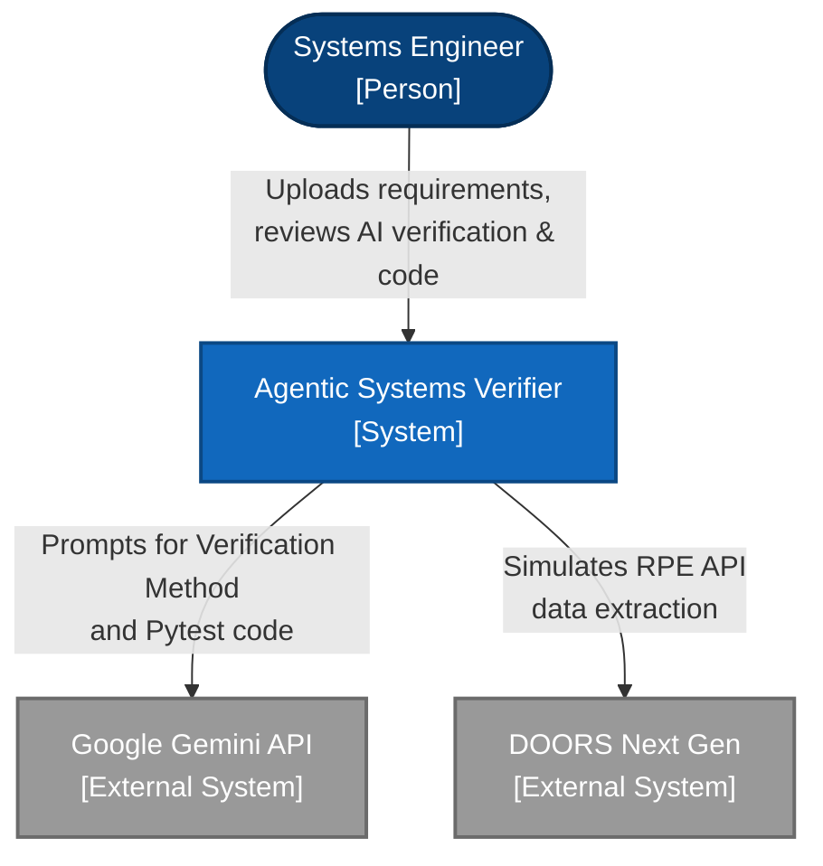
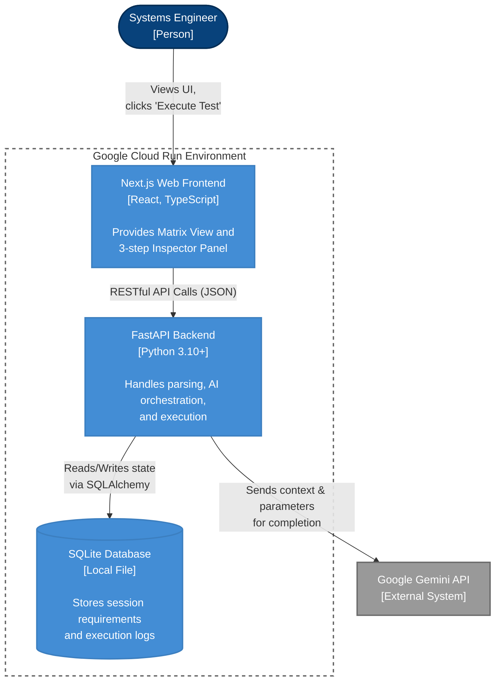
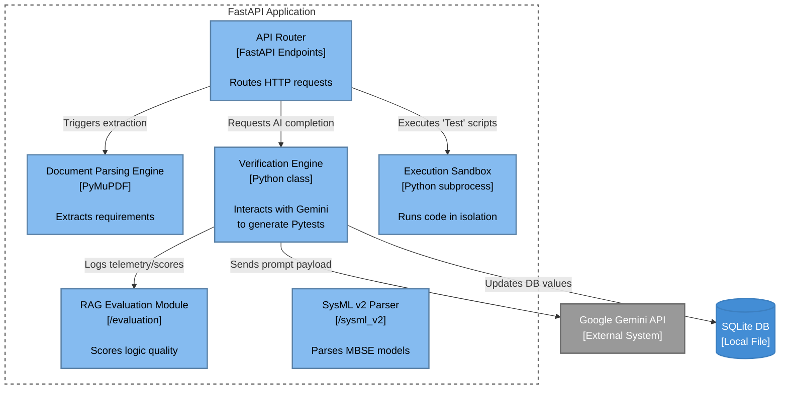

# System Architecture: Agentic Systems Verifier

This document outlines the formal C4 (Context, Container, Component, Code) architecture for the **Agentic Systems Verifier**, a platform designed to automate Systems Engineering workflows (like Requirements Verification) using Large Language Models.

This formalization substantiates Applied AI Architect and Systems Engineering software design claims (EDU_JHU_02).

## 1. System Context Diagram
*The high-level view showing how users and external systems interact with the platform.*

## 2. Container Diagram
*The distinct deployable units that make up the software system.*

## 3. Component Diagram (Backend API)
*Zooming into the Python FastAPI Backend container to view internal architectural blocks.*

## Architectural Design Decisions & Trade-offs
1.  **Monolithic Storage (SQLite):** For MVP velocity and Cloud Run concurrency limitations (Scale to Zero), SQLite provides a simple, self-contained persistence layer without the network overhead of Cloud SQL.
2.  **Stateless Sandboxing (Subprocess):** Generated Pytests are executed via `subprocess.run(["python", "-m", "pytest", temp_file])`. While lacking full Docker isolation, it prevents basic namespace collisions and module bleeding during concurrent execution.
3.  **Client-Side Rate Limiting (10 Items):** Gemini Free-tier limits strictly enforce 15 Requests Per Minute (RPM). The `Next.js` frontend queues batched operations ("Generate Next 10") rather than overwhelming the FastAPI queue.
