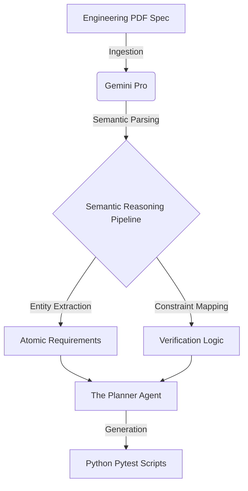

# Process Build Log: Agentic Systems Verifier

## Architectural Reasoning

ASV solves the "AI Hallucination" problem in engineering through strict agent isolation (The "Iron Wall"):

*   **The Architect (Decomposition):** Ingests PDFs, extracts "Shall" statements.
*   **The Planner (Analysis):** Determines Verification Methods (Test, Analysis, Inspection).
*   **The Builder (Execution):** Generates Python `pytest` scripts.
*   **The Auditor (Verification):** Runs tests and rejects code that violates safety constraints.

### 🧠 Semantic Reasoning Pipeline
To bridge the gap between unstructured text and deterministic code, ASV employs a robust Semantic Reasoning pipeline. This pipeline leverages Gemini Pro to semantically parse natural language systems engineering requirements (e.g., from DO-254 or DO-178C specifications) and map them precisely to discrete, verifiable Python test constraints.

