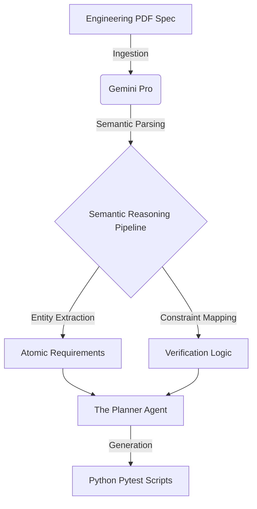

# Agentic Systems Verifier (ASV)

[](https://github.com/yourname/asv/actions/workflows/ci.yml)
[](https://opensource.org/licenses/MIT)
[](https://www.python.org/downloads/)
[](https://agentic-systems-verifier-2rhbgofjzidytbh7fxmqpw.streamlit.app/)

> **ASV automates the Systems Engineering V-Model using Agentic AI.**

ASV transforms static PDF specifications into executable, verified code. It bridges the gap between the "Left V" (Requirements Decomposition) and the "Right V" (Verification & Validation) using a multi-agent architecture.


## ⚡ Quick Start

Get the platform running locally in minutes:

```bash
# 1. Clone the repository
git clone https://github.com/yourname/asv.git
cd asv

# 2. Install dependencies
pip install -r requirements.txt

# 3. Run the application
streamlit run app.py
```

## 🏗️ Architecture

ASV solves the "AI Hallucination" problem in engineering through strict agent isolation (The "Iron Wall"):

*   **The Architect (Decomposition):** Ingests PDFs, extracts "Shall" statements.
*   **The Planner (Analysis):** Determines Verification Methods (Test, Analysis, Inspection).
*   **The Builder (Execution):** Generates Python `pytest` scripts.
*   **The Auditor (Verification):** Runs tests and rejects code that violates safety constraints.

### 🧠 Semantic Reasoning Pipeline
To bridge the gap between unstructured text and deterministic code, ASV employs a robust Semantic Reasoning pipeline. This pipeline leverages Gemini Pro to semantically parse natural language systems engineering requirements (e.g., from DO-254 or DO-178C specifications) and map them precisely to discrete, verifiable Python test constraints.



## 🚀 Key Features

*   **Multimodal Ingestion:** Powered by Gemini Pro to understand complex engineering specs.
*   **Traceability Matrix:** Real-time dashboard tracking every requirement from PDF to Code.
*   **Auto-Code Generation:** One-click generation of verification scripts.
*   **CI/CD Ready:** Includes standard GitHub Actions workflows.

## 🤝 Contributing

We welcome contributions! Please see [CONTRIBUTING.md](CONTRIBUTING.md) for details on how to set up your development environment and submit Pull Requests.

Please note that this project is released with a [Contributor Code of Conduct](CODE_OF_CONDUCT.md). By participating in this project you agree to abide by its terms.

## 📜 License

This project is licensed under the MIT License - see the [LICENSE](LICENSE) file for details.
