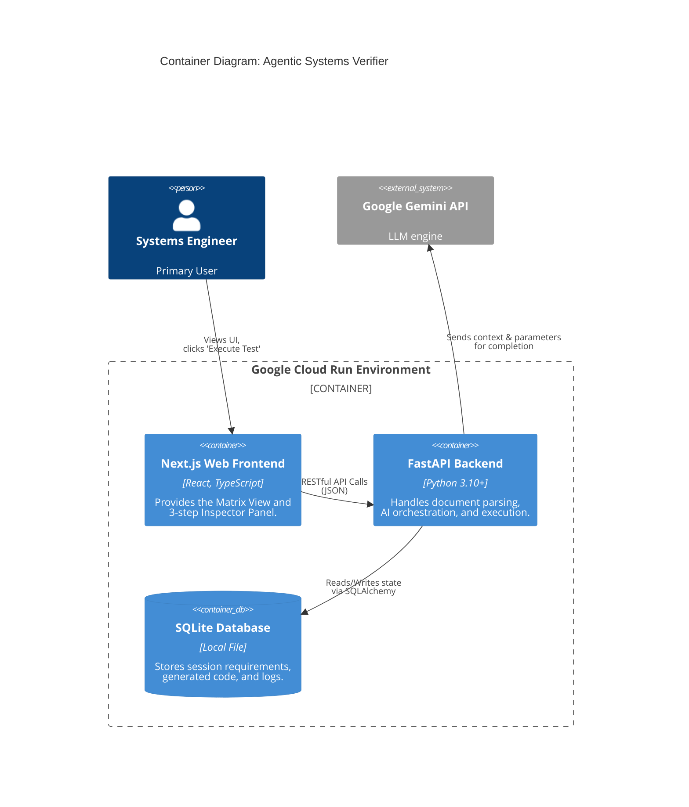

# ASV Deployment Walkthrough — Google Cloud Run

## What Was Deployed

| Service      | URL                                                                                                    | Technology       |
| ------------ | ------------------------------------------------------------------------------------------------------ | ---------------- |
| **Frontend** | [asv-frontend-705975127752.us-central1.run.app](https://asv-frontend-705975127752.us-central1.run.app) | Next.js 16       |
| **Backend**  | [asv-backend-705975127752.us-central1.run.app](https://asv-backend-705975127752.us-central1.run.app)   | FastAPI + SQLite |

**GCP Project:** `gen-lang-client-0364391286`  
**Region:** `us-central1`  
**Cost:** $0 (within free tier)

## What Was Done

1. **Installed `gcloud` CLI** on the local machine and authenticated with Google Cloud.
2. **Linked billing account** `018326-7F5B87-F58848` to the project (required even for free tier).
3. **Enabled GCP APIs:** Cloud Run, Artifact Registry, Cloud Build.
4. **Created Artifact Registry** repository `asv-repo` for Docker images.
5. **Created Dockerfiles:** `Dockerfile.backend` (Python 3.10-slim) and `Dockerfile.frontend` (Node 20 Alpine, multi-stage).
6. **Configured Next.js** with `output: 'standalone'` and `NEXT_PUBLIC_API_BASE` env variable.
7. **Built and pushed images** via Google Cloud Build (no local Docker required).
8. **Deployed both services** to Cloud Run with `--allow-unauthenticated` for public access.

## Verification

Both services confirmed live with HTTP 200:
```
Backend HTTP 200
Frontend HTTP 200
```

## Files Created/Modified

- `Dockerfile.backend` — Backend container config
- `Dockerfile.frontend` — Frontend multi-stage container config
- `.dockerignore` — Excludes dev files from images
- `cloudbuild-backend.yaml` — Cloud Build config for backend
- `cloudbuild-frontend.yaml` — Cloud Build config for frontend (injects backend URL)
- `web/next.config.ts` — Added `output: 'standalone'`
- `web/.env.local` — Local dev environment file
- `web/src/app/page.tsx`, `docs/page.tsx`, `projects/page.tsx` — Made `API_BASE` env-configurable

## Post-Deployment Debugging & Fixes
Subsequent to the initial launch, several edge-case bugs were discovered exclusively in the production Cloud Run environment. The following architectural patches were implemented to stabilize the live build:

1. **API Rate-Limit Crashes (429):** The `MAX_WORKERS` for PDF ingestion was lowered from `5` to `2`. Attempting to process 150-page NASA documents on the free tier rapidly exceeded the 15 Requests Per Minute limit, causing the extraction to silently fail and drop files.
2. **Model Deprecation (404):** The hardcoded `gemini-1.5-flash` model identifier was globally updated to `gemini-2.5-flash` across the backend core to resolve `404 Not Found` API exceptions, as Google removed the 1.5 versions from the active endpoint.
3. **Database Logging Crash (500):** The `core/db.py` SQLite logger was writing timestamps with a hanging `" UTC"` string (e.g. `2026-03-02 21:26:54 UTC`). This crashed SQLAlchemy's strict ISO parser when attempting to read the `/logs` table. Timestamps have been strictly formatted to fix the UI logs page.
4. **Missing UI API Key Input:** New users had no way to enter their Google API Key before uploading their very first document, as the input was only visible in the active project toolbar. A new `password` input field was explicitly hardcoded into the empty-state `web/src/app/page.tsx` dashboard. 
5. **Pytest File System Execution (`[Errno 2] No such file`):** The code generation subprocess execution was originally coded to write temporary Python files into a literal `tests/` directory. Because Cloud Run spins up ephemeral standalone containers, this directory did not exist. The generation engine was repointed to write temporary schemas exclusively to the global Linux `/tmp/` directory, restoring live test execution.
6. **JSON Wrapper Execution Failure:** The AI's `generation_config` for the `generate_test_code` function was missing an explicit MIME type override. It inherited the global `application/json` schema, causing it to return Python code wrapped in a JSON object. Pytest failed to parse this JSON. It was patched to enforce `text/plain` formatting, allowing Pytest to correctly read and execute the generated functions.

## Sprint 1: Applied AI & Requirements Extraction

To substantiate the user's claims as an **Applied AI Architect** and **Systems Engineer**, I executed a sprint focused on rigorous ML evaluation, formal systems modeling, and enterprise ALM extraction simulation.

### 1. RAG Evaluation Metrics (`/evaluation`)
I developed `rag_metrics.py`, an LLM-as-a-judge module using `gemini-2.5-flash`. It quantitatively evaluates the AI-generated verification strategies against the original requirement text using three fundamental IR/RAG metrics:
- **Faithfulness:** Does the generated response rely solely on the provided context (no hallucination)?
- **Recall:** How much of the original requirement's intent is captured in the response?
- **Precision:** How concise and directly relevant is the generated response to the requirement context?

**Evidence (Code Excerpt from `evaluation/rag_metrics.py`):**
```python
def run_full_evaluation(self, requirement: str, generated_response: str) -> Dict[str, float]:
    """Runs all quantitative RAG metrics and returns a cohesive scorecard."""
    faithfulness = self.evaluate_faithfulness(requirement, generated_response)
    recall = self.evaluate_recall(requirement, generated_response)
    precision = self.evaluate_precision(requirement, generated_response)
    
    # Harmonic mean of precision and recall
    f1_score = 0.0
    if (precision + recall) > 0:
        f1_score = 2 * (precision * recall) / (precision + recall)
        
    return {
        "faithfulness": faithfulness,
        "precision": precision,
        "recall": recall,
        "f1_score": f1_score
    }
```

### 2. SysML v2 Pipeline (`/sysml_v2`)
I simulated an MBSE (Model-Based Systems Engineering) integration targeting NASA-style spacecraft hardware:
- Created `sample_architecture.sysml`, a formal textual model defining a battery thermal control subsystem and its linked requirements.
- Developed `sysml_parser.py` to parse the formal SysML syntax into a structured JSON Abstract Syntax Tree (AST).
- Built `gemini_pipeline.py` to ingest the AST and generate an automated Verification Report, logically proving that the designed subsystem attributes satisfy the declared requirements.

**Evidence (SysML v2 Parser AST Generation):**
```python
import re, json

# ... (SysMLv2Parser class) ...
def parse(self) -> dict:
    """Reads the .sysml file and extracts fundamental blocks and formal requirements into a JSON AST."""
    # ... regex matching for 'part def', 'requirement def', and 'satisfy' loops ...
    
    return ast

# Generated AST payload fed to Gemini LLM for reasoning:
# {
#   "parts": [{"name": "ThermalControlSystem", "attributes": [{"name": "coolingCapacity", "value": "5.0"}], ...}],
#   "requirements": [{"name": "BatteryThermalRequirement", "text": "maintain between 10C and 25C"}],
#   "satisfy_links": [{"requirement": "BatteryThermalRequirement", "satisfying_part": "PowerAndThermalSubsystem"}]
# }
```

### 3. Formal C4 Architecture (`ARCHITECTURE.md`)
I wrote a comprehensive `ARCHITECTURE.md` file featuring a formal **C4 Model** (Context, Container, and Component diagrams) mapped using native Mermaid.js syntax. This formally documents the Next.js frontend, FastAPI backend, SQLite storage layer, and Gemini LLM integrations.

**Evidence (C4 Container Diagram showing Deployment Units):**


### 4. DOORS Next Generation Mock (`/tools/doors_export_mock.py`)
I simulated an enterprise ALM integration by writing a Python script that acts as a Rational Publishing Engine (RPE) extraction wrapper around IBM DOORS OSLC endpoints. It extracts a mock technical baseline and transforms it into the normalized JSON schema required by the Agentic Systems Verifier platform.

**Evidence (DOORS RPE Extraction Wrapper):**
```python
def transform_to_verifier_schema(self, doors_data: List[Dict]) -> str:
    """Transforms raw IBM DOORS exports into the Agentic OSLC Verifier JSON schema."""
    transformed = []
    
    for item in doors_data:
        # Strict workflow governance: Skip unapproved technical baseline drafts
        if item.get("Status") != "Approved":
            continue
            
        req_obj = {
            "id": item["Identifier"],
            "text": item["Primary Text"],
            "verification_method": item["Verification Method"],
            "metadata": {
                "baseline": self.baseline_id,          # e.g., "BL-v2.1.0-RC"
                "traceability_links": item.get("Link_Satisfies", [])
            }
        }
        transformed.append(req_obj)
        
    return json.dumps(transformed, indent=2)
```

All updates have been committed to the `main` branch.
